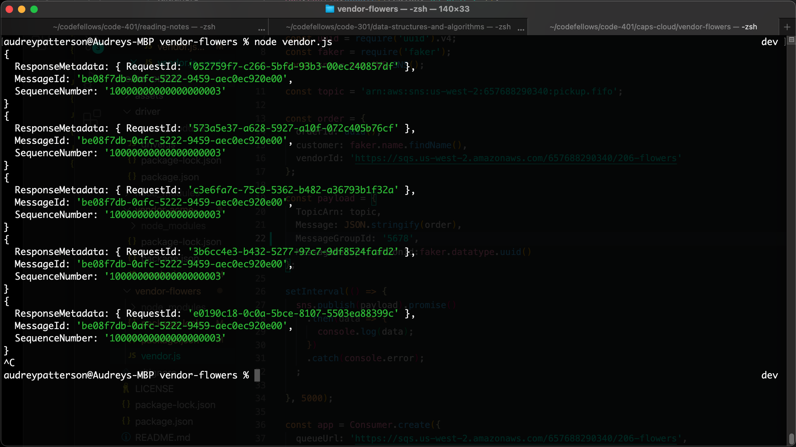
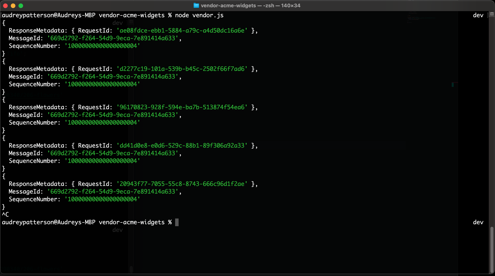
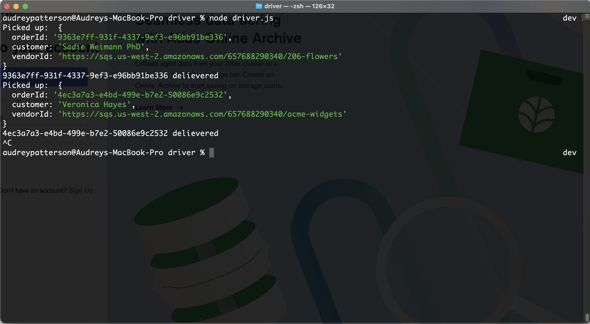

# caps-cloud

# Feature Tasks & Requirements
 Refer to the CAPS System Overview for a complete review of the application, including Business and Technical requirements along with the development roadmap.

# Required Services SNS Topic (FIFO): 
pickup which will receive all pickup requests from vendors. SQS Queue (FIFO): packages which will contain all delivery requests from vendors, in order of receipt. Subscribe this queue to the pickup topic so all pickups are ordered. SQS Queue (Standard) for each vendor (named for the vendor) which will contain all delivery notifications from the drivers. Operations Vendors: Vendors will post “pickup” messages containing delivery information into the SNS pickup topic. { orderId: 1234, customer: "Jane Doe", vendorUrl: queueUrl} Note the queueUrl – this refers to the AWS URL of the vendor’s specific SQS Standard Queue. Pickup requests should be moved into a SQS FIFO Queue called packages for the drivers automatically. (Make the packages queue a subscriber to the pickup topic). Vendors should separately subscribe to their personal SQS Standard Queue and periodically poll the queue to see delivery notifications. Drivers: Drivers will poll the SQS packages queue and retrieve the delivery orders (messages) in order. After a time (e.g. 5 seconds), drivers will post a message to the Vendor specific SQS Standard Queue using the queueUrl specified in the order object. Implementation Notes Work in a non-main branch in a new repository called “caps-cloud”.

Once you have the appropriate queues and topics setup at SNS and SQS, you’ll need some NodeJS applications running to get the system started.

vendor.js should be an SQS Subscriber Connect it to the pickup topic by using it’s URL/ARN Set it up to produce a new message to the “pickup” topic every few seconds, simulating an order The order id and customer name can be randomized Include the URL to the vendor’s personal delivery queue Connect it to their own vendor queue by using it’s URL As drivers deliver, this app will continually poll the queue, retrieve them, and log details out to the console You should be able to disconnect this app, and see deliveries that happened while the app was not running driver.js Connect to the pickup queue and get only the next package Wait a random number of seconds Post a message to the Vendor’s “delivered” Queue (using the supplied URL in the order/message) to alert them of the delivery Repeat until the queue is empty

## Console Screenshots of vendors and drivers

1. Vendor - 206-Flowers

2. Vendor - Acme Widgets

3. Driver
